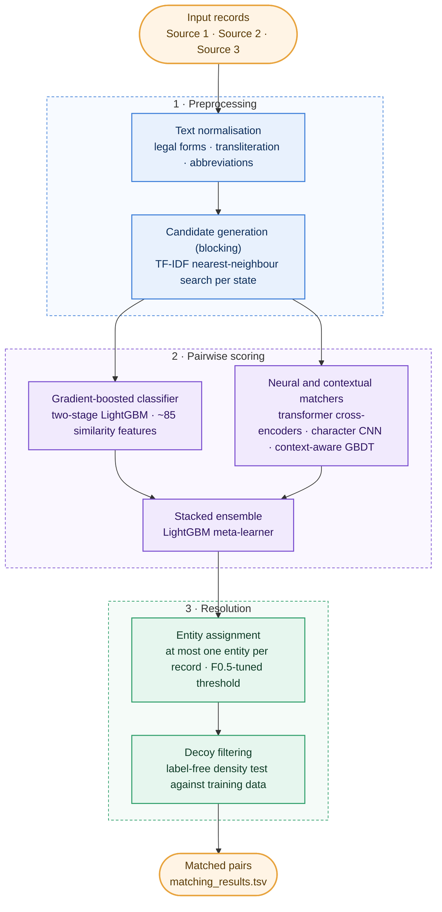

# boltingGBM: Business Entity Resolution

Team **amazingRIVER**'s solution to the **Amazon ML Challenge 2026** (business entity resolution).
Given business records from three sources, find every Source 2 / Source 3 record that describes the same business as
each Source 1 record. Scored by macro F0.5 per Source 1 entity, so a false merge costs about four times a missed match.

| | |
| --- | --- |
| **Best public leaderboard score** | **0.988757** (macro F0.5) |
| **Final rank** | **181** of about 89,399 teams |
| **Validation score** | 0.990 (held-out states, cross-fitted) |
| **Stack** | Python, Polars, LightGBM, fine-tuned transformer cross-encoders |

## Team

- **Varadaraj Borkar** · [@varadarajjborkar](https://github.com/varadarajjborkar)
- **Adit Bissa** · [@aditbissa25](https://github.com/aditbissa25)

## The problem in one paragraph

About 1.7 million Source 1 businesses (US, India and France) each have 0 to 10+ copies in Sources 2 and 3. The copies
carry synthetic noise: abbreviations, typos, legal-form changes, transliterated Indian names, reordered or partial
addresses. Training labels exist only for the US and India; France appears only in the test set. The test set also
contains **look-alike decoys**: records built to resemble a real business (a moved house number, a swapped
descriptor word, a changed legal type) that belong to no one.

## Architecture



## How it works

1. **Text normalisation** (`src/normalize.py`, `src/build_normalized.py`). Undo the noise: strip legal forms and junk
   tokens, fix leetspeak and accents, transliterate Indian scripts, expand abbreviations, parse state and region,
   compute phonetic codes.
2. **Candidate generation, or blocking** (`src/p1_block.py`). Within each state, ten TF-IDF nearest-neighbour searches
   over different keys (name, phonetic name, address, name + address, house number, transliterated name and others),
   plus a reverse search. About 4.7 candidates per Source 1 record, with most true pairs kept.
3. **Gradient-boosted pair classifier** (`src/p1_train.py`, `src/p1_score.py`). A two-stage LightGBM over about 85
   features: string similarity (Jaro-Winkler, token overlap, TF-IDF cosine), house-number agreement, token rarity,
   and candidate-rank features (how a pair compares with the record's other candidates).
4. **Neural matchers and stacking** (`models/`). Fine-tuned transformer cross-encoders (MiniLM-L6/L12,
   multilingual-e5-small, mDeBERTa-v3-base), a character-level CNN and a context-aware gradient-boosting model each
   score the pairs. A LightGBM meta-learner stacks all scores. It is fitted on held-out validation states with
   two-fold cross-fitting, so no pair is scored by a model that saw it.
5. **Entity assignment** (`src/decide.py`). Each Source 2 / Source 3 record is linked to at most one Source 1 entity,
   its highest-scoring one, and a single probability threshold is tuned for macro F0.5.
6. **Decoy filtering** (`postprocess/`). The largest late gain. Decoy patterns that exist only in the test set were
   found without labels, using a **density test**: for each pattern of pair (for example "same name, legal form
   added, house number shifted slightly"), compare how many such pairs the test set holds per 1,000 Source 1 records
   with the rate among true matches in training. The excess is decoys, so the whole pattern is removed. Removing
   French descriptor-word swaps alone added +0.0035.
7. **Final blend** (`postprocess/final/`). An ensemble of LightGBM variants (including extremely randomised trees)
   revises only borderline pairs, and only where both validation folds improved.

## Score progression (public leaderboard)

| Step | Score |
| --- | --- |
| Two-stage LightGBM baseline | 0.9713 |
| Stacked ensemble with cross-encoders | 0.9803 |
| Full stacked ensemble, recall recovery, France and state-level fixes | 0.9834 |
| French descriptor-swap decoys removed | 0.9869 |
| Better recall (dense retrieval, second-pass candidate search) | 0.9877 |
| More decoy patterns removed (US, India, France) | 0.9885 |
| **Final model blend and decoy filters** | **0.988757** |

## Repository layout

```text
boltingGBM/
├── src/
├── models/
│   ├── context_gbm/
│   ├── cross_encoders/
│   ├── minilm/
│   └── stage3/
├── postprocess/
│   ├── checks/
│   ├── decoy/
│   ├── final/
│   ├── fixes/
│   └── overlay/
├── data/
├── docs/
├── run_all.sh
├── requirements.txt
├── LICENSE
└── README.md
```

## Quick start

```bash
python3.11 -m venv .venv && source .venv/bin/activate
pip install -r requirements.txt
# put the challenge data at data/student_resource/dataset/{train,test}/ (or set ER_DATA_DIR)
bash run_all.sh
```

`run_all.sh` rebuilds the two-stage LightGBM baseline and writes `output_bucket/repro/matching_results.tsv`. The full
final chain (cross-encoders, stacked ensemble, decoy filtering) is described step by step in
[`docs/METHOD.md`](docs/METHOD.md) and [`postprocess/final/README.md`](postprocess/final/README.md). The
cross-encoders need a GPU; everything else runs on a laptop (16 GB RAM).

## Models and licences

LightGBM (MIT); `cross-encoder/ms-marco-MiniLM-L6-v2` and `-L12-v2` (Apache-2.0); `intfloat/multilingual-e5-small`
(MIT); `microsoft/mdeberta-v3-base` (MIT). All are under 8B parameters and were fine-tuned on training data only. No
external data or APIs are used. The competition data is not included in this repository.

## License

[MIT](LICENSE) © 2026 Varadaraj Borkar and Adit Bissa
